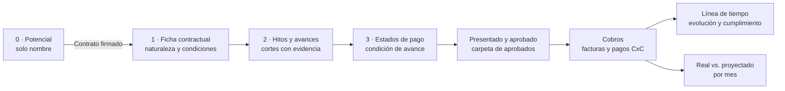

# Manual de Gestión de Proyectos, Hitos y Estados de Pago

Este manual explica cómo usar el módulo de Gestión de proyectos de CxC PHO y cómo se relacionan sus partes. El recorrido comienza con un contrato potencial y termina comparando el dinero cobrado con la proyección mensual.

La pantalla se abre desde **Proyectos** en el menú principal o en:

`http://127.0.0.1:3000/proyectos`

Dentro de la barra de vistas, la pestaña **Manual** abre una guía resumida para consultar el flujo sin salir del sistema. Este documento contiene el detalle operativo y técnico completo.

La información de proyectos se guarda en `data/private/projects.json`, fuera del código del sistema. La información de facturas y pagos se consulta desde el módulo existente de CxC.

## Recorrido de trabajo

Cada etapa tiene una responsabilidad distinta:

| Parte | Qué se registra | Qué habilita |
| --- | --- | --- |
| Potencial | Nombre del contrato posible | Mantenerlo separado hasta confirmar la firma |
| Ficha contractual | Cliente, viviendas, m², naturaleza, monto, fechas y condiciones | Crear la secuencia de seguimiento |
| Hitos y avances | Cantidades acumuladas, porcentajes, fechas y evidencia | Preparar EDP cuando se alcanza un umbral |
| Estados de pago | Condición, monto, fechas y estado documental | Seguir el recorrido del EDP |
| Cobros | Facturas vinculadas y pagos/abonos reales | Calcular el real cobrado y el saldo pendiente |
| Líneas de tiempo | Base, previsión y cumplimiento | Revisar compromisos y atrasos |
| Historial | Cambios y datos anteriores | Conservar trazabilidad sin pedir un motivo al usuario |

## 0. Agregar un contrato potencial

1. Entrar a **Proyectos**.
2. Abrir la pestaña **0 · Potenciales**.
3. Pulsar **Agregar potencial**.
4. Escribir únicamente el **nombre del contrato**.
5. Pulsar **Agregar potencial**.

El contrato queda con estado **Pendiente de firma**. Se puede cambiar su nombre desde **Editar nombre**. En esta etapa no se piden cliente, RUT, viviendas, monto, moneda, fechas ni documentos; esos datos se completan cuando el contrato ya está firmado.

Un potencial no se incorpora a los proyectos firmados, no aparece en la comparación de cobros y no genera hitos ni EDP activos.

## Confirmar la firma

1. En la lista de potenciales, revisar el nombre.
2. Pulsar **Contrato firmado**.
3. El sistema cambia el estado a **Firmado** y lo abre en la ficha contractual.

Si la fecha de firma estaba vacía, el sistema registra la fecha del día usando la zona horaria de Chile. Si ya había una fecha guardada, la conserva.

La firma no inventa fechas de fabricación, despachos, fundaciones ni montaje. Solo habilita el siguiente paso: completar la ficha y seleccionar la naturaleza.

## 1. Completar la ficha contractual

En el proyecto firmado, abrir **1 · Vista general** y pulsar **Editar ficha**.

Completar los datos que correspondan:

- Nombre del proyecto.
- Cliente o mandante y RUT.
- Ubicación y responsable de CDG.
- Cantidad de viviendas.
- Superficie total contratada en m².
- Tipo de contrato, moneda y monto contractual con IVA incluido.
- Fecha de firma, inicio de referencia y término contractual.
- Supuesto UF cuando sea necesario expresar proyecciones en pesos.
- Enlace HTTPS a la carpeta de EDP aprobados.
- Condiciones y eventos que habilitan el pago.
- Observaciones y datos pendientes.

El supuesto UF es una referencia de proyección ingresada por CDG. Los cobros reales se mantienen en pesos y no se recalculan con una UF histórica.

### Elegir la naturaleza

La naturaleza define las etapas que aparecerán en el recorrido:

| Naturaleza | Alcance |
| --- | --- |
| 1 | Fabricación y TGM |
| 2 | Fabricación, TGM y urbanización interior |
| 3 | Fabricación, TGM, urbanización interior y exterior |
| 4 | Fabricación, TGM y urbanización exterior |

TGM significa **Traslado, Grúa y Montaje**.

Todas las naturalezas siguen esta secuencia:

**Contrato firmado → Anticipo → Fabricación → Despachos → Fundaciones → Montaje → Urbanización interior o exterior cuando corresponda → Avance total**.

La secuencia ordena el seguimiento. No obliga a que las etapas se ejecuten una después de otra si el contrato establece actividades paralelas.

Al guardar la naturaleza, el sistema crea las etapas que faltaban y conserva el hito de firma o los EDP que ya existían. No duplica etapas si se vuelve a guardar la ficha.

## 2. Hitos y avances

Abrir **2 · Hitos y avances**. La pantalla usa una navegación por etapas:

- La columna o barra de etapas muestra el recorrido completo.
- Cada etapa indica si está sin medición, en avance o cumplida.
- El porcentaje se calcula solo cuando existe una medición válida.
- Al seleccionar una etapa, aparece su detalle, sus fechas y su historia.

### Registrar un avance

1. Seleccionar la etapa en **Recorrido del proyecto**.
2. Pulsar **Registrar avance**.
3. Indicar la fecha del corte.
4. Ingresar el total acumulado de la medición.
5. Agregar la evidencia o referencia del informe.
6. Pulsar **Guardar avance**.

El formulario no pide un motivo de registro o cambio. El sistema genera automáticamente el registro de historial correspondiente.

Las mediciones disponibles son:

| Etapa | Medición |
| --- | --- |
| Fabricación | m² fabricados acumulados y casas terminadas acumuladas |
| Despachos | Casas despachadas acumuladas |
| Fundaciones | Casas con fundación terminada o porcentaje de avance |
| Montaje | Casas montadas acumuladas |
| Urbanización interior | Porcentaje acumulado |
| Urbanización exterior | Porcentaje acumulado |
| Avance total | Porcentaje contractual informado con evidencia |

El sistema no promedia automáticamente las etapas ni inventa ponderaciones para el avance total.

### Qué significa un corte de avance

El corte es la fecha que limita la lectura histórica. Si se consulta el 31 de agosto, se usa la última medición registrada hasta ese día. Una medición de septiembre queda fuera de esa lectura.

Ejemplo:

- 10 de agosto: 500 m² fabricados.
- 15 de agosto: 750 m² fabricados.
- Corte consultado: 12 de agosto.
- Resultado: se muestran 500 m².

Un corte no es una factura, una fecha de aprobación ni un cobro. Es una fotografía fechada del avance acumulado.

### Historia y gráfico

La etapa seleccionada muestra:

- **Compromiso inicial:** fecha base confirmada.
- **Fecha prevista actual:** última programación vigente.
- **Cumplimiento efectivo:** fecha en que la evidencia demuestra que se alcanzó el 100% de la etapa.
- **Evolución del avance:** gráfico con los cortes conocidos.
- **Historia de avances:** lista de registros ordenados del más reciente al más antiguo.

Las mediciones faltantes no se convierten en cero y no se unen con una línea inventada. Si se informa nuevamente un 100% en una fecha posterior, se conserva como cumplimiento la primera fecha en que se alcanzó el 100% de forma sostenida.

### Actualizar un hito programado

El botón **Programar hito** sirve para registrar o cambiar fechas de compromiso. El campo **Alcance** ofrece únicamente:

- Fabricación
- Despacho
- Fundaciones
- Montaje
- Urbanización Interior
- Urbanización Exterior

El formulario tampoco solicita un motivo. Se puede definir fecha base, fecha prevista, estado, evidencia y observaciones según el tipo de hito. Las fechas base confirmadas se conservan cuando se reprograma la fecha vigente.

## 3. Estados de pago

Abrir **3 · Estados de pago**. Esta pantalla está organizada en dos zonas:

- Filtros y lista de EDP a la izquierda.
- Detalle y recorrido del EDP seleccionado a la derecha.

Los filtros permiten ver todos los EDP, los que están por habilitar, preparados, presentados, aprobados o sin condición.

### Planificar un EDP

1. Pulsar **Planificar EDP**.
2. Escribir el nombre del EDP.
3. Elegir el hito que lo habilita.
4. Elegir la medición requerida.
5. Ingresar el umbral acumulado.
6. Indicar la fecha prevista de aprobación.
7. Indicar el monto individual que se espera cobrar.
8. Indicar la fecha esperada de cobro.
9. Confirmar las fechas y el monto como plan base si corresponde.
10. Guardar.

El monto corresponde a ese EDP, no al acumulado de todos los EDP. Debe considerar la estructura del contrato, anticipos, retenciones e impuestos aplicables para no contar un mismo ingreso dos veces.

Se pueden crear varios EDP parciales para una misma etapa. Por ejemplo, un EDP puede habilitarse a los 500 m² y otro a los 1.000 m².

### Condiciones posibles

El umbral se puede expresar en:

- m² fabricados.
- Casas terminadas.
- Casas despachadas.
- Casas con fundación terminada.
- Casas montadas.
- Porcentaje de fundaciones.
- Porcentaje de urbanización interior o exterior.
- Porcentaje de avance total.

Para el contrato firmado y el anticipo, la firma del contrato permite iniciar la preparación documental; el pago del anticipo se comprueba después con CxC.

### Recorrido documental del EDP

Cada EDP se muestra con este recorrido:

1. **Planificado:** existe el EDP y su plan base puede estar por confirmar.
2. **Preparado:** el avance guardado alcanza el umbral. Es una señal interna para que CDG revise la documentación.
3. **Presentado:** CDG registra que el EDP fue presentado.
4. **Aprobado:** se registra fecha y referencia a la carpeta de aprobados.
5. **Cobro parcial o cobrado:** se determina desde los pagos de las facturas vinculadas.

El sistema no crea una factura, no sube un archivo a SharePoint y no registra dinero cuando un EDP pasa a **Preparado** o **Aprobado**.

### Historia de un EDP

El detalle del EDP muestra:

- Condición de avance y valor alcanzado al corte.
- Monto proyectado y fecha esperada.
- Dinero cobrado al corte.
- Línea de estados desde planificación hasta cobro.
- Historia de preparación, presentación, aprobación y pagos.
- Enlaces a la trazabilidad de CxC para revisar cada factura.

Si un EDP presentado o aprobado tiene un avance posterior inferior al umbral, conserva su estado documental y muestra una advertencia para revisión. El sistema no borra una aprobación ya registrada.

## Conectar facturas y pagos de CxC

Desde **Cobros**, dentro de un proyecto:

1. Revisar la lista de facturas sugeridas por RUT.
2. Seleccionar la factura.
3. Seleccionar el EDP o anticipo asociado.
4. Pulsar **Vincular factura**.

La factura queda asignada completa a un único proyecto y a un único hito. Varias facturas pueden vincularse al mismo EDP. En esta versión no se divide una factura entre proyectos.

Los pagos y abonos se leen desde CxC por fecha efectiva de pago. Una fecha de emisión, vencimiento, aprobación del EDP o compromiso no se considera dinero cobrado.

Una nota de crédito no se considera un cobro. Los movimientos negativos que estén registrados como pagos o ajustes reducen el dinero recibido.

El vínculo no modifica la factura en Bemmbo o Buk. Solo establece la relación que permite que el proyecto la incluya en su trazabilidad y en su proyección.

## Cobros y real versus proyectado

La matriz mensual muestra por proyecto y por mes:

- **Proy.:** monto esperado según el plan base o la proyección vigente.
- **Real:** suma de pagos y abonos efectivamente registrados en CxC.
- **Δ:** real menos proyectado.

Se puede cambiar entre **Plan base confirmado** y **Proyección vigente**.

Reglas de lectura:

- Un mes futuro muestra la proyección, pero no inventa un real.
- La variación se calcula solo en meses cerrados con planificación completa.
- Un dato faltante aparece como `—`, no como cero.
- Un EDP en UF necesita un supuesto UF para expresarse en pesos, salvo que el saldo completo esté respaldado por facturas en pesos.
- Con facturación parcial, la proyección vigente conserva el mayor entre el monto previsto y lo facturado, menos lo cobrado.
- Cuando CDG confirma que las facturas cubren todo el EDP, se utiliza el saldo de las facturas vinculadas.

Al seleccionar un mes se abre el detalle de los EDP previstos y de los pagos registrados en ese período.

## Líneas de tiempo y cumplimiento

La vista **Líneas de tiempo** permite revisar todos los proyectos o un proyecto específico. Usa estos elementos:

- Rombo oscuro: fecha base confirmada.
- Marca naranja: previsión o propuesta.
- Punto verde: cumplimiento efectivo acreditado.
- Línea roja: fecha de corte.

El indicador **Cumplimiento a tiempo** considera solo hitos confirmados cuya fecha base ya venció al corte. Divide los hitos cumplidos dentro de la fecha base por los hitos exigibles. No es un porcentaje de avance físico ni de dinero cobrado.

## Vista general e historial

La **Vista general** reúne:

- Datos contractuales.
- Naturaleza y alcances.
- Cobrado al corte.
- Próximos compromisos.
- Pendientes documentales de CDG.
- Fuentes y carpeta de aprobados.

La vista **Historial** conserva la fecha, el estado anterior y los cambios realizados. El usuario no escribe un motivo; el sistema crea una descripción automática para fichas, hitos, avances, EDP y vínculos de facturas.

## Quién hace qué

| Responsable | Acción dentro del flujo actual |
| --- | --- |
| CDG | Registra potenciales, confirma firmas, completa la ficha, define la naturaleza, programa hitos y EDP, ingresa avances y revisa cumplimiento |
| Operaciones | Mantiene su carga de EDP, informes, despachos y avances en las carpetas de proyecto que ya utiliza |
| Contabilidad | Mantiene su facturación y registro de pagos en CxC |
| Sistema | Consolida avances registrados por CDG, calcula estados, conecta facturas vinculadas, muestra cobros y conserva historial |

Operaciones y Contabilidad no necesitan agregar un paso de carga dentro de esta versión. CDG debe registrar la referencia al documento o al informe que sirve como evidencia.

## Cómo se conectan las funciones

La conexión interna se divide en cuatro capas:

### Datos y reglas de proyecto

- `frontend/src/modules/projects/types/index.ts` define proyectos, etapas, avances, condiciones EDP y vínculos de facturas.
- `frontend/src/modules/projects/data/project-workflow.ts` define las cuatro naturalezas, las etapas activas, porcentajes físicos, anticipo y lectura al corte.
- `frontend/src/modules/projects/data/project-history.ts` construye la serie histórica, el gráfico de avance y los pagos de cada EDP.
- `frontend/src/modules/projects/data/project-calculations.ts` calcula cumplimiento, montos, real versus proyectado y fechas.

### Pantallas

- `project-forms.tsx`: alta de potencial, ficha contractual y actualización de hitos.
- `project-workflow.tsx`: bandeja de potenciales, recorrido de etapas, historia de avances, filtros de EDP y detalle del EDP.
- `project-history.tsx`: línea histórica y gráfico de avance.
- `project-timeline.tsx`: línea de tiempo contractual.
- `project-cash.tsx`: matriz mensual y asociación de facturas.
- `projects-view.tsx`: navegación, corte, selección de proyecto y coordinación entre las pantallas.

### Reglas y persistencia del backend

- `backend/src/modules/projects/domain/project-workflow.js` crea la secuencia de naturaleza, valida los avances y cambia automáticamente un EDP a **Preparado** cuando el umbral está alcanzado.
- `backend/src/modules/projects/domain/project-validation.js` valida fechas, cantidades, porcentajes, etapas, moneda, naturaleza y evidencia.
- `backend/src/modules/projects/application/projects-service.js` aplica las reglas dentro de una transacción, conserva la base confirmada y genera el historial automático.
- `backend/src/modules/projects/infrastructure/local-projects-repository.js` guarda el archivo privado con escritura atómica y controla revisiones para evitar sobrescribir una actualización más reciente.

### API

| Método | Ruta | Uso |
| --- | --- | --- |
| GET | `/api/projects` | Cargar proyectos y estado de integración |
| POST | `/api/projects/save` | Guardar una ficha, etapa, avance, EDP o vínculo de factura |

El frontend no lee archivos privados ni credenciales. Las integraciones contables permanecen centralizadas en el backend.

## Validaciones importantes

El sistema rechaza:

- Firmas o fechas documentales futuras.
- Avances anteriores a la firma.
- Cantidades superiores a las viviendas o m² contratados.
- Porcentajes mayores a 100.
- Avances sin evidencia.
- EDP incompatibles con la naturaleza o con la etapa elegida.
- Presentación anterior al avance que habilita el EDP.
- Aprobación sin fecha o sin referencia a la evidencia aprobada.
- Cambio o eliminación de una fecha base confirmada.
- Asociación duplicada de una misma factura.
- Desaparición de un EDP presentado o aprobado.

Una actualización que llega desde una versión antigua del proyecto conserva los hitos y permite clasificarlos con una naturaleza sin duplicar la información existente.

## Rutina recomendada

### Al recibir un contrato potencial

1. Crear el potencial con su nombre.
2. Confirmar la firma solo cuando exista el contrato celebrado.
3. Completar la naturaleza y los datos contractuales.

### En cada seguimiento de obra o fábrica

1. Seleccionar la etapa correspondiente.
2. Registrar la medición acumulada, la fecha y la evidencia.
3. Revisar los EDP que hayan pasado a **Preparado**.
4. Registrar presentación y aprobación cuando exista respaldo.

### En cada revisión de CxC

1. Vincular las facturas al proyecto y al EDP correcto.
2. Revisar abonos y pagos reales.
3. Comparar la matriz mensual con la proyección vigente.
4. Investigar diferencias negativas o meses con datos faltantes.

### Al cierre de cada mes

1. Fijar el corte en el último día del mes.
2. Revisar la historia de avances por etapa.
3. Revisar EDP preparados, presentados y aprobados.
4. Revisar el real cobrado y la variación contra el plan base.
5. Registrar pendientes de CDG en la vista general.

## Microsoft 365 y límites actuales

La ficha puede guardar y abrir el enlace a la carpeta HTTPS de EDP aprobados. La aplicación todavía no:

- Detecta automáticamente nuevos archivos en OneDrive o SharePoint.
- Envía correos a Contabilidad u Operaciones.
- Lee automáticamente una carpeta para convertir un archivo en avance.
- Identifica usuarios autenticados como autores del historial.

Por ahora, el flujo conserva la forma de trabajo existente: Operaciones y Contabilidad siguen usando sus carpetas y sistemas, mientras CDG registra en CxC la referencia necesaria para gestionar el proyecto.

## Preguntas frecuentes

### ¿Un EDP aprobado significa que ya se cobró?

No. La aprobación es documental. El real se muestra únicamente cuando existen pagos o abonos de una factura vinculada.

### ¿Qué pasa si todavía no hay factura?

El EDP puede estar preparado, presentado o aprobado, pero el cobro aparece como pendiente o desconocido hasta que la factura y sus pagos estén disponibles.

### ¿Puedo corregir un avance?

Sí. Se agrega un nuevo corte con su propia fecha y evidencia. El registro anterior se conserva en la historia.

### ¿Puedo cambiar la naturaleza?

Sí mientras no se intente eliminar una etapa que ya tenga avances, EDP o compromisos confirmados. El sistema impide perder esa trazabilidad.

### ¿Por qué un mes aparece con `—`?

Porque falta una fecha, un monto, el supuesto UF, la factura vinculada o la fuente de cobros. `—` significa dato no disponible, no cero.

### ¿Qué diferencia hay entre plan base y proyección vigente?

El plan base conserva la fecha y monto originalmente confirmados. La proyección vigente refleja la última programación guardada. La comparación permite ver la desviación sin borrar el compromiso inicial.
